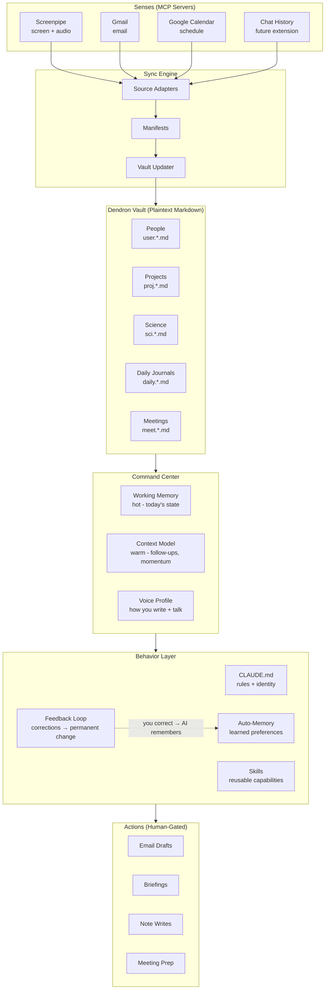

# I Let OpenClaw Run My Life for a Week. No One Noticed (Yet).

> An open-source personal AI operating system built on
> Claude Code, MCP servers, and plaintext markdown.
>
> **[Blog Post](https://kejunying.com/blog/agentic-cortex)** ·
> **[Quick Start](#-quick-start)** ·
> **[Architecture](#-architecture)**

Last week my AI agent drafted emails in my voice, briefed me every morning on stale follow-ups and project momentum, caught a forgotten deadline I would have missed, and prepared meeting context before I sat down. Nobody on the receiving end noticed. When I corrected it once — "don't double-space after paragraphs in emails" — it never made that mistake again. No fine-tuning. No training run. Just a line in a markdown file.

This repo is the system behind that. Fork it, customize it, make it yours.

---

## Safety First

- **Local-only data.** Screenpipe recordings, chat history, and vault contents never leave your machine. The AI reads local markdown files. There is no cloud sync unless you add one.
- **Drafts, not sends.** The AI creates email drafts in Gmail; you review and hit send. Chat messages go to your clipboard; you paste. It never contacts anyone autonomously.
- **Plaintext control.** Every rule is a line in a markdown file. Delete the line, the behavior stops. There is no black box — `grep` your entire config in seconds.
- **Permission gates.** Claude Code prompts before any filesystem write, shell command, or MCP action that affects the outside world. You approve or reject each one.

This is not a legal disclaimer. It is a threat model. The attack surface is: (1) what the AI can read on your disk, and (2) what you approve it to do. Both are auditable.

---

## What Is This?

Most AI tools treat every conversation as a blank slate. You explain who you are, what you're working on, who the people are, what happened last time — every single session. The information exists somewhere in your notes, your email, your calendar. The AI just can't see it.

This project inverts that. Your notes **become** the AI's permanent memory. People profiles, project files, meeting notes, and daily journals form a structured knowledge graph that the AI reads at session start and updates as it goes. A working memory file tracks what's hot right now — today's calendar, live tasks, stale follow-ups. A context model tracks medium-term state — project momentum, collaborator threads, decisions made and why. The vault itself is long-term storage. Three tiers of memory, all plaintext, all version-controlled.

The key insight: **structured plaintext is the ideal persistent memory format for AI agents.** It's human-readable, git-diffable, greppable, and the AI navigates it natively. No vector database, no embeddings, no retrieval pipeline. Just hierarchical markdown files with consistent naming conventions. The AI resolves `user.sarah-kim.md` the same way you'd open a file — by knowing where to look. People are the connective tissue: every email, meeting, project, and follow-up links back to a person. Say "prepare for meeting with Sarah" and the system pulls her profile, your last three interactions, her current projects, and any open threads — in seconds, not minutes.

---

## Architecture



**Data flow**: External sources (Gmail, Calendar, Screenpipe) feed into source adapters that normalize data into manifests — structured diffs describing what changed. The vault updater writes those changes into the appropriate markdown files. The command center reads the vault and distills it into working memory (what matters right now) and a context model (medium-term state). The behavior layer — your CLAUDE.md instructions, skills, and accumulated feedback memories — shapes how the AI acts on that knowledge. Every output is human-gated: drafts you review, briefings you read, notes you approve.

The feedback loop is the critical piece. When you correct the AI, it saves the correction as a persistent memory file. Next session, it reads that file and adjusts. Over time, the system converges toward your preferences without any fine-tuning or training infrastructure.

---

## Prerequisites

- **Required**: Git, Python 3.9+, Node.js 18+
- **AI Agent**: [Claude Code](https://docs.anthropic.com/en/docs/claude-code) / [OpenClaw](https://github.com/nicobailon/openclaw) (tested), or any agent that reads `CLAUDE.md` and supports MCP ([Cursor](https://cursor.sh), [Windsurf](https://codeium.com/windsurf), [Gemini CLI](https://github.com/google-gemini/gemini-cli))
- **Notes**: [Dendron](https://www.dendron.so/) (VS Code extension) recommended, but any hierarchical markdown system works ([Obsidian](https://obsidian.md), [Logseq](https://logseq.com), flat folders with naming conventions)
- **Optional**: [Screenpipe](https://screenpi.pe/) (Chapter 5), Gmail MCP server (Chapter 5), Google Calendar MCP server (Chapter 5)

## Quick Start

```bash
git clone https://github.com/Albert-Ying/agentic-cortex.git
cd agentic-cortex
./setup.sh
```

`setup.sh` will:
1. Ask for your vault location (default: `~/agentic-cortex-vault`)
2. Copy the seed vault with example notes
3. Set up your identity (name, email)
4. Install project-scoped skills and memory structure
5. Print instructions to start your first session

Then open your vault directory in your editor and start an AI agent session. The system will brief you automatically.

---

## Build Your Own

### Chapter 1: The Vault — Structured Memory

**What**: Hierarchical markdown notes as the AI's long-term memory.
**Why**: Flat files are unsearchable at scale. Databases are opaque to humans. Hierarchical markdown is both human-readable and AI-navigable — the AI finds things the same way you do, by following naming conventions.

The vault uses Dendron-style dot-separated hierarchies. Every note's filename encodes its category and position in the knowledge graph:

```
user.sarah-kim.md        # person profile
proj.2026.protein-design.md   # project file
meet.2026.03.14.md       # meeting notes
daily.journal.2026.03.14.md   # daily journal
sci.biology.aging-clocks.md   # science topic
```

This is not arbitrary. When the AI needs to find all people, it globs `user.*.md`. All projects: `proj.*.md`. All meetings this month: `meet.2026.03.*.md`. No embeddings, no search index — just filesystem conventions that both humans and AI agents understand natively.

Here's what a person profile looks like (from the seed vault):

```yaml
---
id: a7m2xk9pqr4vn1w3jt8hc5b
title: Sarah Kim
desc: 'PI, Aging & Systems Biology Lab, Westfield University'
updated: 1710100000000
created: 1700000000000
---
```

```markdown
## Contact Info
- Email: skim@westfield.edu
- Institution: Westfield University, Dept. of Biological Sciences

## Role & Expertise
Professor of biology and PI of the Aging & Systems Biology Lab.
Research focuses on epigenomic drivers of cellular aging.

## Context
**How we connected**: PhD advisor → postdoc advisor. I joined her
lab in 2024 after finishing my PhD.
**Last contact**: 2026-03-14 (weekly lab meeting)

## Notes
- Prefers 1:1 meetings on Tuesdays, 30 min max
- Connected me to James Taylor for the review article opportunity
```

The AI reads this and knows: Sarah is Jamie's advisor, prefers short Tuesday meetings, and is the source of a review article connection. When Jamie says "prepare for my 1:1 with Sarah," the AI has everything it needs without asking a single clarifying question.

**Setup**:

1. Your vault was created by `setup.sh` with the seed notes. Explore the structure:

```bash
ls seed-vault/user.*.md    # 15 people profiles
ls seed-vault/proj.*.md    # 3 project files
ls seed-vault/meet.*.md    # 2 meeting notes
ls seed-vault/daily.*.md   # 7 daily journals
```

2. Create your first real note. Add a person you interact with frequently:

```bash
# In your vault directory, create a person note:
touch user.your-colleague.md
```

Then fill in the template: frontmatter, contact info, context, notes. The more you add, the more the AI can do.

3. Create a project note for something you're actively working on:

```bash
touch proj.2026.your-project.md
```

**Checkpoint**: Create 3 people notes and 1 project note with real content. Start an AI agent session in your vault. Ask: "What do you know about [person name]?" and "What's the status of [project]?" The AI should find and summarize the notes without help.

---

### Chapter 2: The Instructions — CLAUDE.md as DNA

**What**: Project-level instruction files that define who the AI is and how it behaves.
**Why**: Instead of re-explaining your preferences every session, write them once. The AI reads `CLAUDE.md` at session start and follows it permanently.

`CLAUDE.md` is to an AI agent what DNA is to an organism. It encodes identity, behavioral rules, and operating procedures. Claude Code (and compatible tools) automatically reads this file from the project root at the start of every session.

Here's the structure from `config/CLAUDE.md`:

```markdown
# Personal AI Operating System

## Role
You are {{USER_NAME}}'s **personal operating system** in this
workspace. This is a command center built on a Dendron knowledge vault.

Your job on every session start:
1. Read working memory and context model to restore situational awareness
2. Invoke the command center skill to check if state needs refreshing
3. Proactively brief {{USER_NAME}} on what matters right now

## What You Track
- **Projects**: status, momentum, next milestones, blockers
- **People**: last contact, open threads, pending items
- **Follow-ups**: promises made, deadlines approaching
- **Daily activity**: calendar, screenpipe-ingested activity
- **Decisions**: what was chosen and why

## Behavioral Expectations
- Don't wait to be asked. Surface what's important.
- Be concise but complete.
- Update working memory and context model every session.
- Resolve context autonomously — search vault, email, screenpipe
  before asking.
- Draft emails via gmail_create_draft. Messages go to clipboard.
```

The `{{USER_NAME}}` placeholder gets replaced by `setup.sh` during installation. After that, this is your system prompt — readable, editable, version-controlled.

**Two levels of instructions**:

| Level | Location | Scope |
|-------|----------|-------|
| **Global** | `~/.claude/CLAUDE.md` | Applies to every project on your machine |
| **Project** | `<vault-root>/CLAUDE.md` | Applies only when the agent is in your vault |

Global preferences go in the global file: your name, commit conventions, data integrity rules. Vault-specific behavior — the command center role, tracking rules, key file locations — goes in the project-level file.

**Setup**:

1. `setup.sh` already created your project `CLAUDE.md`. Open it and review:

```bash
cat CLAUDE.md
```

2. Customize the identity section. Add rules specific to how you want the AI to behave. Some ideas:
   - Communication style ("be direct, skip pleasantries")
   - Domain conventions ("use ISO 8601 dates everywhere")
   - Safety rules ("never push to main without asking")

3. If you want global preferences (applied across all projects), create or edit `~/.claude/CLAUDE.md`.

**Checkpoint**: Start a new AI agent session in your vault. The AI should greet you by name and know it's operating as your personal OS. Ask it something that requires following a rule from `CLAUDE.md` — e.g., "draft an email" should produce a Gmail draft (not inline text) if that's what the instructions say.

---

### Chapter 3: The Memory — Persistent Context

**What**: An auto-memory system that accumulates knowledge across sessions.
**Why**: Without persistent memory, every conversation starts from zero. The AI forgets your preferences, your corrections, your project context. Memory makes continuity possible.

Claude Code's auto-memory system writes to `~/.claude/projects/<escaped-path>/memory/`. This is outside the vault itself — it's the AI's private scratchpad, indexed by a `MEMORY.md` file that links to topic-specific files.

The memory directory structure:

```
~/.claude/projects/-path-to-your-vault/memory/
├── MEMORY.md            # Index — concise, links to topic files
├── command-center.md    # Follow-ups, momentum, collaborator state
├── projects.md          # Active project notes
├── feedback_drafting.md # Learned: how you want emails drafted
├── feedback_testing.md  # Learned: your testing preferences
└── ...                  # More topic files accumulate over time
```

`MEMORY.md` is the root index. Keep it under 200 lines — it's a table of contents, not a brain dump. The real content lives in topic files.

**Four memory types emerge naturally**:

| Type | Example File | Purpose |
|------|-------------|---------|
| **User** | `user_identity.md` | Who you are, accounts, affiliations |
| **Feedback** | `feedback_drafting.md` | Corrections you've made — see [Chapter 8](#chapter-8-the-feedback-loop--rlhf-through-conversation) |
| **Project** | `projects.md` | Active work status, decisions, blockers |
| **Reference** | `reference_file_locations.md` | Stable facts the AI needs repeatedly |

**Save triggers** — the AI should write to memory when:
- A task is completed or a meaningful milestone is reached
- A decision is made or an approach is chosen
- You correct something or state a preference
- New project context or conventions are discovered
- A previous memory entry becomes outdated

The key discipline: **don't document every interaction.** Only write when there's genuine signal worth persisting. Memory should reflect current reality, not be a log file.

**Setup**:

1. `setup.sh` created the memory directory with a starter `MEMORY.md` and `command-center.md`. Check:

```bash
ls ~/.claude/projects/*/memory/
```

2. The global preferences file (`~/.claude/CLAUDE.md`) already includes the persistent memory protocol. The AI knows when to save. You don't need to tell it.

3. To bootstrap faster, tell the AI key facts about yourself in the first session: "I'm a postdoc in Sarah's lab working on protein design and epigenetic clocks. My K99 is due in May." It will save this to memory and recall it next session.

**Checkpoint**: Tell the AI something specific about yourself or your preferences. End the session. Start a new session. The AI should reference what you told it last time without being prompted.

---

### Chapter 4: The Command Center — Working Memory + Context Model

**What**: A three-tier memory system — working memory (hot), context model (warm), vault (cold) — with an automated briefing at session start.
**Why**: The AI needs to distinguish between what's urgent right now, what's simmering in the background, and what's archived knowledge. Without this, it treats a two-week-old task list the same as today's calendar.

Think of it like human cognition. Working memory is what you're holding in your head right now — today's meetings, the task you're in the middle of, the email you need to reply to. The context model is what you'd recall with a moment's thought — project momentum over the last two weeks, who you owe follow-ups to, decisions you made last week. The vault is everything you've ever written down — retrievable but not top of mind.

**Working Memory** (`_working-memory.md`) — refreshed every session:

```markdown
## Current Focus
**Primary**: K99 grant application — specific aims page near final
**Secondary**: Protein binder design — 12 candidates in pipeline
**Tertiary**: Review article — methods drafted, deadline April 15

## Today's Calendar (Mar 15)
- 10:00 — Call with Tom Nguyen (career advice)
- 14:00 — Library writing block (K99 significance section)
- 16:00 — Yoga class

## Source Sync Status
| Source | Last Synced | Status |
|--------|-------------|--------|
| Calendar | 2026-03-15 08:00 | current |
| Email | 2026-03-14 17:00 | 1 day stale |
| Screenpipe | 2026-03-14 23:59 | awaiting today |

## Live Tasks
- [ ] Incorporate Sarah's K99 feedback
- [ ] Draft K99 significance and innovation section
- [ ] Start NBRF letter of intent (due April 1)

## Stale Follow-ups
- Alex Novak — awaiting Chronos Bio SAB details (sent Mar 13)
- Kevin Wu — need to send formal data use agreement
```

**Context Model** (`memory/command-center.md`) — updated end of session:

Tracks project momentum (rising/falling/stalled), collaborator state (last contact, open threads), and follow-up queues (high/medium/low priority). This is the "warm" layer between today's urgency and the full vault.

**The 5-agent briefing**: At session start, the command center skill orchestrates five checks:
1. **Calendar sync** — fetch today + 7 days, update working memory
2. **Email sync** — scan inbox for new items, triage by priority
3. **Screenpipe sync** — ingest recent screen/audio activity
4. **Staleness sweep** — flag follow-ups older than 3 days with no response
5. **Momentum check** — compare project activity against expected cadence

The result is a briefing delivered proactively — you don't ask for it. You sit down, start a session, and the AI tells you what matters.

**Setup**:

1. The seed vault includes `_working-memory.md` pre-populated with example content. Review it:

```bash
cat _working-memory.md
```

2. The command center skill is installed at `.claude/skills/command-center/SKILL.md`. It defines the briefing flow, sync matrix, and memory tier system.

3. Customize `_working-memory.md` with your real focus areas, then let the AI take over updates. After the first sync, it will maintain this file automatically.

**Checkpoint**: Start a session. The AI should produce a briefing without being asked: current focus, today's calendar, sync status, live tasks, and any stale follow-ups. If a data source is stale, it should flag that too.

---

### Chapter 5: The Senses — Connecting Data Sources

**What**: MCP servers that give the AI live access to Gmail, Google Calendar, and Screenpipe (screen + audio recording).
**Why**: An operating system that can't perceive your world is just a chatbot with a good memory. The senses turn it from reactive to proactive.

MCP (Model Context Protocol) is an open standard that lets AI agents call external tools through a unified interface. Each data source gets a "source adapter" — a skill that knows how to query the MCP server, normalize the data, and write it into the vault.

**The sync pipeline**:

```
Source (MCP Server) → Source Adapter → Manifest → Vault Updater → Vault
```

- **Source Adapter**: Queries the MCP server (e.g., `gcal_list_events`), extracts relevant data
- **Manifest**: A structured diff — "these 3 calendar events are new, this email thread has a reply, this person was mentioned in screenpipe"
- **Vault Updater**: Writes manifest data into the appropriate vault files — new events into working memory, new people into `user.*.md`, new threads into the context model

**Gmail** — `mcp__claude_ai_Gmail`:
- `gmail_search_messages` to scan inbox
- `gmail_read_thread` for full conversation context
- `gmail_create_draft` for AI-composed responses (you review before sending)
- Feeds: inbox triage in working memory, interaction history in person profiles, follow-ups in context model

**Google Calendar** — `mcp__claude_ai_Google_Calendar`:
- `gcal_list_events` for today + 7-day preview
- `gcal_get_event` for meeting details
- Feeds: daily calendar in working memory, last-meeting dates in person profiles

**Screenpipe** — local MCP server:
- Records screen content and audio (runs locally, data stays on your machine)
- The preprocessor script (`scripts/preprocess_screenpipe.py`) deduplicates and structures raw data
- Feeds: activity timelines in daily journals, interaction detection for person profiles

**Setup**:

1. **Gmail & Calendar**: These use Anthropic's first-party MCP connectors. Enable them in your Claude Code MCP settings:

```json
{
  "mcpServers": {
    "gmail": {
      "type": "url",
      "url": "https://mcp.anthropic.com/gmail"
    },
    "google-calendar": {
      "type": "url",
      "url": "https://mcp.anthropic.com/google-calendar"
    }
  }
}
```

You'll authenticate via OAuth on first use.

2. **Screenpipe**: Install from [screenpi.pe](https://screenpi.pe/) and enable its MCP server. Screenpipe runs locally — all recordings stay on your machine.

3. **Test the sync**: Start an AI session and invoke the sync skill:

```
> /sync
```

The AI should pull today's calendar events, recent emails, and any available screenpipe data, then update working memory accordingly.

**Checkpoint**: After running `/sync`, check `_working-memory.md`. It should have today's real calendar events and any flagged emails. The source sync status table should show current timestamps.

---

### Chapter 6: The Voice — Teaching AI How You Write

**What**: A voice profile extracted from your real writing history that lets the AI draft in your voice.
**Why**: Generic AI writing is immediately recognizable. If the AI drafts an email that sounds like ChatGPT, everyone knows. A voice profile makes the output indistinguishable from something you'd write yourself.

The voice profile lives at `me/VOICE_PROFILE.md` and captures your communication fingerprint across registers:

- **Writing mechanics**: Sentence length, punctuation habits, hedging patterns, use of contractions
- **Formal register**: How you write to advisors, editors, collaborators
- **Informal register**: How you write to friends, lab mates
- **Chat voice**: Slack, texts, quick messages
- **Key patterns**: Structural preferences, verbal tics, humor style

From the seed vault's voice profile:

```markdown
## Key Patterns

1. **Leads with the conclusion**: The main point comes in the first
   sentence. Context follows.
2. **Numbered lists over bullet points**: When organizing parallel
   items, defaults to 1/2/3 rather than bullets.
3. **Specific over approximate**: Prefers "47 candidates" over
   "about 50," "n=2,400" over "a large cohort."
4. **Em-dash over parentheses**: Uses em-dashes (—) to insert
   asides and qualifications.
5. **Active voice, first person**: "I ran the analysis" not "the
   analysis was run."
```

When the AI sees "draft an email to Sarah about the K99 revisions," it reads the voice profile, selects the formal register, and produces something like:

> Hi Sarah — attached is the updated aims page with the revised threshold analysis. Main change: expanded candidate pool from 47 to 83 by relaxing the energy cutoff to -1.5 REU. Happy to discuss at our Tuesday 1:1.

Not "I hope this email finds you well. I wanted to follow up regarding the recent revisions to our K99 application."

**How to build your voice profile**:

1. **Collect samples**: Export your last 100-200 sent emails. If you have chat history (Slack exports, message logs), include those too. The more registers you cover, the better.

2. **Extract patterns**: Ask the AI to analyze your writing samples:

```
> Here are my last 200 sent emails. Analyze my writing style:
> sentence structure, word choice, greeting patterns, sign-off
> patterns, use of hedging language, punctuation habits. Create
> a voice profile.
```

3. **Refine by register**: The AI should distinguish how you write to your boss vs. your friends vs. your family. If it doesn't, feed it register-specific samples and ask it to separate them.

4. **Save to vault**: Write the result to `me/VOICE_PROFILE.md` in your vault. The command center and drafting skills reference this file automatically.

**Setup**:

1. The seed vault includes an example voice profile at `me/VOICE_PROFILE.md`. Review it for structure.

2. Replace it with your own. Even a rough first draft — a paragraph describing how you write — is better than nothing. You can refine it over time.

3. Test it: ask the AI to draft an email to someone in your vault. Compare the output to your recent sent emails. If the tone is off, tell the AI what's wrong. It will update the voice profile (see [Chapter 8](#chapter-8-the-feedback-loop--rlhf-through-conversation)).

**Checkpoint**: Ask the AI to draft an email to a colleague about a real topic. Read it aloud. Does it sound like something you'd actually send, or does it sound like AI? If the latter, feed it more writing samples and iterate.

---

### Chapter 7: The People Graph — Relationships as Connective Tissue

**What**: Structured profiles for every person you interact with, continuously updated from all data sources.
**Why**: People are the graph edges connecting your emails, meetings, projects, and follow-ups. When the AI knows your people, every interaction becomes contextualized.

In this system, a person is not just a contact card. A person profile aggregates everything: how you met, when you last talked, what you're working on together, what's pending between you, how they prefer to communicate, and notes that give the AI judgment about the relationship.

From the seed vault:

```markdown
# user.sarah-kim.md

## Context
**How we connected**: PhD advisor → postdoc advisor
**Last contact**: 2026-03-14 (weekly lab meeting)

## Notes
- Prefers 1:1 meetings on Tuesdays, 30 min max
- Strongly encourages all postdocs to apply for K99 by year two
- Connected me to James Taylor for the review article opportunity
```

When the AI says "you have a 1:1 with Sarah tomorrow," it's not just reading the calendar. It knows Sarah is your advisor, that she gave K99 feedback last Friday, that she prefers 30-minute meetings, and that the open thread is incorporating her preliminary data suggestions into Aim 1. That context arrives automatically.

**How profiles get updated**:

1. **Email sync**: New email from Kevin Wu → AI updates `user.kevin-wu.md` with the interaction date and content summary
2. **Calendar sync**: Meeting with Rachel Brown → AI updates `user.rachel-brown.md` with last-contact date
3. **Screenpipe**: You mentioned Tom Nguyen in a conversation → AI flags it as an interaction
4. **Manual**: You tell the AI "I met Lisa Wang at coffee today, she mentioned Helix Therapeutics" → AI updates or creates `user.lisa-wang.md`

The `detect-people` skill scans incoming data for names, matches them against existing profiles, and flags unrecognized names for you to confirm. Over time, your people graph grows organically from your actual interactions.

**The people index** (`user.md`):

A central index file categorizes all profiles:

```markdown
## Advisors & PIs
- [[Sarah Kim|user.sarah-kim]] — postdoc advisor, Westfield
- [[Michael Chen|user.michael-chen]] — PhD advisor, Pacific IT

## Lab
- [[David Lee|user.david-lee]] — postdoc, yeast display
- [[Emma Zhang|user.emma-zhang]] — PhD student, clock models

## Network
- [[Alex Novak|user.alex-novak]] — Chronos Bio, SAB opportunity
```

This index gives the AI a bird's-eye view of your social graph. It can answer "who do I know at Chronos Bio?" or "which collaborators haven't I contacted in two weeks?" by scanning this file and cross-referencing with last-contact dates.

**Setup**:

1. Start with 5-10 profiles for people you interact with most. Use the seed vault profiles as templates.

2. For each person, fill in at minimum: how you connected, their role, and last contact date. Everything else is enrichment that accumulates over time.

3. Create a `user.md` index that categorizes your profiles by relationship type.

4. Enable the `detect-people` skill. When you run `/sync`, it will scan new emails and calendar events for names and suggest profile updates.

**Checkpoint**: Say "prepare for meeting with [name]" to the AI. It should pull their profile, recent interactions, open threads, and any relevant project context. If you have email/calendar connected, it should include data from those sources too.

---

### Chapter 8: The Feedback Loop — RLHF Through Conversation

**What**: When you correct the AI, it saves the correction as a persistent memory file. Next session, it reads that memory and doesn't repeat the mistake.
**Why**: This is the mechanism that makes the system converge toward *you* over time. Without it, you're correcting the same behavior every session. With it, each correction is permanent.

This is the intellectual heart of the project. Here's why.

#### The Analogy: Language as Reward Signal

In traditional machine learning, you improve a model through reward signals. You label data, compute a loss, run backpropagation, update weights. In RLHF (reinforcement learning from human feedback), you train a reward model from human preferences, then optimize the policy against it. Both require training infrastructure — GPUs, datasets, pipelines.

Here, **natural language corrections ARE the reward signal.** The architecture maps directly:

| ML Concept | Agentic Cortex Equivalent |
|-----------|--------------------------|
| Base policy | `CLAUDE.md` — the default behavioral instructions |
| Sub-policies | Skills — reusable capabilities with their own rules |
| Reward signal | Your correction — "don't do X" or "always do Y" |
| Gradient update | Feedback memory file — persistent, read at session start |
| Updated weights | AI behavior in subsequent sessions |

The difference: no training run. No GPU. No dataset curation. You say "that's wrong, do it this way," and the system updates permanently. The inference engine (the LLM) is the same — what changes is the context it reads.

#### The Feedback Memory Format

When the AI receives a correction worth persisting, it creates a feedback memory file:

```markdown
---
name: email-drafting-style
description: Single line breaks in email drafts, not double
type: feedback
---

Use single line breaks between paragraphs in email drafts,
not double line breaks.

**Why:** Double line breaks look wrong in Gmail's compose
window and make emails appear artificially spaced. The user
noticed recipients could tell the email was AI-drafted from
the spacing alone.

**How to apply:** When drafting any email via gmail_create_draft,
use \n between paragraphs, not \n\n. Applies to all registers
(formal, informal, follow-up).
```

Three fields matter:

1. **The rule itself** — what to do or not do
2. **Why** — the reason behind the correction, often referencing a specific incident
3. **How to apply** — when and where this guidance activates

#### Why "Why" Matters

A rule without context is brittle. "Never `git init` at `~/`" is a rule. But if the AI only knows the rule, it applies it blindly. Add the why — "a prior `.git` at home directory ballooned to 52GB because it tracked binary-heavy subdirectories" — and now the AI understands the **principle**: don't track directories with large binary content. It can generalize. If you later ask it to initialize a git repo in a directory full of `.h5` files, it will hesitate and warn you, even though no rule specifically mentions `.h5` files.

The `how to apply` field handles scope. A correction about email formatting applies to `gmail_create_draft` calls, not to writing markdown notes. A correction about commit messages applies to `git commit`, not to PR descriptions (unless the principle extends). Scoping prevents over-generalization — the AI doesn't become paranoid about line breaks everywhere just because you corrected one email.

#### The Compounding Effect

Each correction adds a feedback memory. Over 10 sessions, you might accumulate 15-20 of them. The AI reads every feedback memory at session start — they're small files, a few lines each. The cumulative effect is significant:

```
Session 1:  Base behavior (CLAUDE.md only)
Session 3:  +3 feedback memories → emails tighter, commits cleaner
Session 7:  +8 feedback memories → drafts match your voice, knows your pet peeves
Session 15: +18 feedback memories → feels like a trained assistant, not a generic AI
```

No fine-tuning was involved. No API calls to a training endpoint. No dataset of preference pairs. Just markdown files accumulating in a directory, read at session start, shaping the context window. The LLM weights never change — the prompt does.

This is closer to how human assistants learn. You correct them, they write it down, they check their notes next time. The difference is that AI assistants have perfect recall of their notes and never skip a step.

#### Concrete Example: The Full Lifecycle

1. **The correction happens.** You're reviewing an email draft and say: "Don't start emails with 'I hope this finds you well.' I never write that."

2. **The AI saves it.** A new file appears in memory:

```markdown
---
name: email-no-pleasantries
description: Never open emails with filler pleasantries
type: feedback
---

Never start emails with "I hope this finds you well," "I hope
you're doing well," "I wanted to reach out," or similar
throat-clearing phrases.

**Why:** The user considers these filler. Their natural email
style leads with the point — context or a question in the first
sentence, never a pleasantry.

**How to apply:** All email drafts via gmail_create_draft.
Start with the recipient's name, then the substance. Formal
emails can start with "Hi [Name] —" followed immediately by
the point. Informal emails skip the greeting entirely.
```

3. **Next session**: The AI reads all feedback memories during startup. This one loads alongside 12 others.

4. **The behavior changes**: You say "draft a reply to James about the review deadline." The AI produces:

> Hi James — I'll have the computational methods section ready by April 15 as discussed. One question: should the comparison table cover Rosetta vs. AlphaFold approaches, or do you want a broader survey? Let me know.

No "I hope this email finds you well." Not now, not ever again.

5. **You never correct this again.** The feedback memory persists across sessions, across weeks, across months. As long as the file exists, the behavior holds.

#### What This Means

The system's behavior is fully auditable. Want to know why the AI avoids pleasantries in emails? `grep -r "pleasantries" ~/.claude/projects/*/memory/`. Want to undo a correction? Delete the file. Want to see how much the AI has learned about you? `ls ~/.claude/projects/*/memory/feedback_*.md | wc -l`.

There is no hidden state. No weight matrix you can't inspect. No reward model you didn't label. Every behavioral adaptation is a file you wrote (or approved the AI to write), in plain English, stored in a directory you control. This is what makes it different from fine-tuning — it's transparent, reversible, and composable.

**Setup**:

1. This works out of the box. The persistent memory protocol is already in your global preferences (`~/.claude/CLAUDE.md`).

2. To seed it, correct the AI on something in your first few sessions. Be specific: "When you draft emails to my advisor, use formal register. When you draft to lab mates, use lowercase and skip greetings."

3. Check that corrections persist:

```bash
ls ~/.claude/projects/*/memory/feedback_*.md
```

4. Read a feedback file to verify it captured the why and scope, not just the rule.

**Checkpoint**: Correct the AI on a specific behavior. End the session. Start a new session. Trigger the same behavior. Verify the AI follows your correction without being reminded.

---

### Chapter 9: The Daily Briefing — Putting It All Together

**What**: Every session starts with a proactive briefing — calendar, task status, stale follow-ups, project momentum — delivered without being asked.
**Why**: This is where the operating system metaphor stops being a metaphor. You sit down, open a session, and the AI already knows what you need to focus on.

**The session-start flow**:

```
1. AI reads _working-memory.md (hot state from last session)
2. AI reads memory/command-center.md (warm state)
3. AI runs source syncs: Calendar → Email → Screenpipe
4. AI updates working memory with new data
5. AI runs staleness sweep on follow-ups
6. AI delivers briefing
```

**What a briefing looks like**:

```
Good morning. Here's your state:

FOCUS
  K99 specific aims — Sarah's feedback still pending integration.
  Aim 1 needs binding energy distributions as preliminary data.

TODAY (Mar 15)
  10:00  Call with Tom Nguyen (career advice)
  14:00  Library block — K99 significance section
  16:00  Yoga

STALE (needs attention)
  Alex Novak — Chronos Bio SAB interest sent Mar 13, no reply.
  Consider a gentle follow-up today or Monday.
  Kevin Wu — cohort metadata received, DUA not yet sent.

MOMENTUM
  Protein design: HIGH — 12 candidates in pipeline, yeast display
    screening imminent
  K99 application: MEDIUM — aims drafted but needs more prelim data
  Review article: LOW — 800 words added this week, deadline Apr 15.
    On track but not a priority yet.

INBOX (flagged)
  James Taylor — review section assignment confirmed, Apr 15 deadline
  Conference registration confirmation — Comp Aging Bio Symposium

Want me to draft the Alex Novak follow-up?
```

The AI surfaces what you'd otherwise have to assemble manually from your calendar, email, task list, and memory. It catches the stale follow-up you forgot about. It ranks project momentum so you know where energy is going. And it offers to take action — always as a draft, always with your approval.

**Customizing the briefing**:

The command center skill (`skills/command-center/SKILL.md`) defines the briefing structure. You can modify:

- **Sync cadence**: Which sources to check at session start (remove screenpipe if you don't use it)
- **Staleness thresholds**: How many days before a follow-up is flagged (default: 3)
- **Momentum signals**: What counts as "high" vs "low" activity for a project
- **Briefing format**: Add or remove sections to match your workflow

**Setup**:

1. Make sure Chapters 1-5 are configured. The briefing depends on: vault notes (Ch 1), CLAUDE.md (Ch 2), memory (Ch 3), working memory (Ch 4), and at least one data source (Ch 5).

2. Start a session. If everything is configured, you'll get a briefing automatically. If a data source fails to sync, the briefing will note which source is stale.

3. After the briefing, interact normally. At session end, the AI updates the context model with any new follow-ups, momentum changes, or decisions made during the session.

**Checkpoint**: Start a fresh session from scratch. Without typing anything beyond your first message, you should receive a briefing covering: current focus, today's calendar, any stale items, and project momentum. If a source is unavailable, the briefing should say so rather than silently omitting it.

---

## FAQ

**Does this only work with Claude Code?**

The architecture is tool-agnostic. You need an AI agent that reads markdown instruction files at session start and supports MCP for external data sources. Claude Code and OpenClaw are tested. Cursor, Windsurf, and Gemini CLI should work with the same `CLAUDE.md` and skill files — the MCP tool names (`gmail_*`, `gcal_*`) are standardized. The feedback loop (Chapter 8) works with any agent that supports auto-memory or a similar persistence mechanism.

**How much setup time?**

Chapters 1-3 take about 30 minutes and give you a working system with persistent memory and basic vault structure. Chapter 4 adds another 15 minutes for the command center. Chapters 5-9 are incremental — add them over days or weeks as you want more capabilities. The system is useful from Chapter 1 onward.

**Is my data safe?**

Everything is local plaintext files in directories you control. No data is sent to any server beyond the AI API calls themselves (which are subject to your API provider's privacy policy). Screenpipe data stays on your machine. Email and calendar access uses OAuth tokens stored locally by your MCP server. The AI never sends emails or messages autonomously — it creates drafts that you review. You can audit every file the system has written with `find` and `grep`.

**What if I don't use Dendron?**

Any hierarchical markdown system works. Obsidian users can adopt the same naming conventions (`user.*.md`, `proj.*.md`) with folders instead of dots — `user/sarah-kim.md` instead of `user.sarah-kim.md`. Logseq works similarly. Even flat directories with consistent naming conventions are sufficient — the AI navigates by glob patterns, not by any specific tool's metadata. Dendron's advantage is native hierarchical support in VS Code, but it's not required.

**Can I contribute?**

Fork and make it yours. Issues are welcome for bugs in `setup.sh` or the bundled skills. PRs are welcome for new skills — if you build a Notion sync adapter, a Slack MCP integration, or a weekly review generator, others will want it. See the skill directory structure for the format.

---

## What's Next

This repo covers the core architecture. Extensions not included here but straightforward to build:

- **Weekly/monthly review generation** — aggregate daily journals into summaries
- **Research literature integration** — PubMed/bioRxiv MCP for paper tracking
- **Website sync** — publish selected vault notes to a static site
- **Team vaults** — shared context models for lab groups or teams
- **Multi-language voice profiles** — separate voice fingerprints per language

The pattern is always the same: add a data source (MCP server or file import), write a source adapter (skill), and let the vault updater flow new data into the existing graph. The architecture scales horizontally.

---

## License

MIT. See [LICENSE](LICENSE).

Built by [Kejun Albert Ying](https://kejunying.com).

Tested with Claude Code. Requires `CLAUDE.md` support and MCP integration.

*Version 0.1.0 — March 2026*
