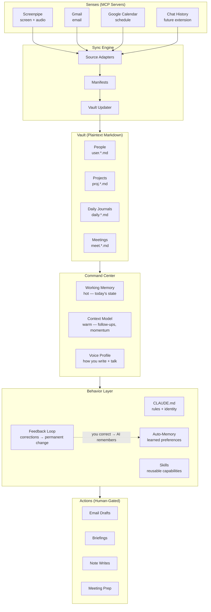

# OpenClaw 🦞 Agentic Cortex

> A personal AI operating system that shares your memory, your voice, and your taste — built on structured markdown, MCP integrations, and a natural-language feedback loop.

**[Quick Start](#quick-start)** · **[Architecture](#architecture)** · **[Documentation](#chapters)** · **[FAQ](#faq)**

---

## What Makes This Different

Storing notes in markdown is not new. Obsidian, Logseq, and Dendron all do it. What none of them do is close the loop: structured markdown as persistent AI memory + MCP integrations for live data + a feedback RL mechanism that reshapes AI behavior from natural language corrections + voice cloning extracted from your writing history + ambient intelligence from screen and audio recording.

The result is an AI agent that has the same memory as you — and even more precise memory. It has the same taste as you, the same voice as you. When it drafts an email, it writes like you write: same sentence structure, same hedging patterns, same register-switching between your boss and your friends. When you correct it once, it never makes that mistake again. No fine-tuning. No training run. Just a line in a markdown file.

**Core technical contributions:**

- **Feedback RL loop.** Natural language corrections become persistent behavioral rules. Each correction is saved as a structured memory file with the rule, the reason, and the scope. The AI reads all accumulated feedback at session start. Over 10-20 sessions, the system converges toward your judgment and preferences — no gradient descent, no reward model, no training infrastructure. See [Chapter 8](#chapter-8-the-feedback-loop).
- **Voice cloning from writing history.** The voice profile is extracted from your real sent emails and chat messages — sentence length distributions, punctuation habits, greeting patterns, register differences. The AI drafts in your voice across formal, informal, and chat registers. Recipients cannot tell. See [Chapter 6](#chapter-6-voice-profile).
- **Screenpipe ambient intelligence.** Continuous local screen and audio recording feeds into the AI's context. The AI knows what you were working on without you telling it — it ingests activity timelines, detects interactions, and updates the knowledge graph automatically. See [Chapter 5](#chapter-5-data-sources).
- **Shared memory model.** Three-tier memory (working memory / context model / vault) gives the AI access to everything you know: your notes, your people, your projects, your follow-ups, your decisions and why you made them. See [Chapter 4](#chapter-4-command-center).

---

## Safety Model

- **Local-only data.** Screenpipe recordings, chat history, and vault contents never leave your machine. No cloud sync unless you add one.
- **Drafts, not sends.** Email drafts go to Gmail for your review. Chat messages go to clipboard. The AI never contacts anyone autonomously.
- **Plaintext control.** Every rule is a line in a markdown file. Delete the line, the behavior stops. `grep` your entire config in seconds.
- **Permission gates.** The agent (Claude Code / OpenClaw) prompts before any filesystem write, shell command, or MCP action that affects the outside world.

---

## Architecture



**Data flow:** External sources feed source adapters that produce structured manifests (diffs of what changed). The vault updater writes changes into markdown files. The command center distills the vault into working memory (what matters now) and a context model (medium-term state). The behavior layer — CLAUDE.md, skills, and accumulated feedback memories — shapes how the AI acts. Every output is human-gated.

### The Naming Convention Is the Schema

The foundation of the entire system is a single design decision: **dot-separated filenames that encode type, time, and relationships**.

```
user.priya-sharma.md                → type=person,  name=priya-sharma
proj.2026.api-redesign.md           → type=project, year=2026, name=api-redesign
meet.2026.03.14.md                  → type=meeting, date=2026-03-14
daily.journal.2026.03.14.md         → type=journal, date=2026-03-14
sci.engineering.distributed-systems.md → type=science, domain=engineering, topic=distributed-systems
```

The filename IS the schema. No database, no config file, no ORM. An AI agent navigates the entire knowledge graph through glob patterns alone:

- `user.*.md` → all people
- `proj.2026.*.md` → this year's projects
- `meet.*.md` + grep for `user.priya-sharma` → all meetings with Priya
- `sci.engineering.*.md` → all engineering notes

Cross-links inside notes (`[[Priya Sharma|user.priya-sharma]]`) create the graph edges. The hierarchy gives you type safety. The wikilinks give you relationships. Together, they form a knowledge graph that's human-readable, git-trackable, and AI-navigable — with zero infrastructure.

This is borrowed from [Dendron](https://www.dendron.so/)'s hierarchical note system, but the pattern works with any file-based notes. The key insight: **when your naming convention is consistent, your filesystem becomes a queryable graph**.

---

## Prerequisites

- **Required:** Git, Python 3.9+, Node.js 18+
- **Agent:** [OpenClaw](https://github.com/nicobailon/openclaw) or [Claude Code](https://docs.anthropic.com/en/docs/claude-code) (tested). Any agent that reads `CLAUDE.md` and supports MCP should work ([Cursor](https://cursor.sh), [Windsurf](https://codeium.com/windsurf), [Gemini CLI](https://github.com/google-gemini/gemini-cli)).
- **Notes:** Any hierarchical markdown system — [Dendron](https://www.dendron.so/), [Obsidian](https://obsidian.md), [Logseq](https://logseq.com), or flat folders with naming conventions.
- **Optional:** [Screenpipe](https://screenpi.pe/) (Chapter 5), Gmail MCP server (Chapter 5), Google Calendar MCP server (Chapter 5).

## Quick Start

```bash
git clone https://github.com/Albert-Ying/agentic-cortex.git
cd agentic-cortex
./setup.sh
```

`setup.sh` will:
1. Ask for your vault location (default: `~/agentic-cortex-vault`)
2. Copy the seed vault with example notes
3. Set up your identity (name, email)
4. Install project-scoped skills and memory structure
5. Print instructions to start your first session

Then open your vault directory in your editor and start an agent session. The system will brief you automatically.

---

## Chapters

### Chapter 1: The Vault — Structured Memory

Hierarchical markdown notes as the AI's long-term memory. The vault uses dot-separated naming conventions — every filename encodes its category and position in the knowledge graph:

```
user.priya-shah.md              # person profile
proj.2026.nimbus-platform.md    # project file
meet.2026.03.14.md              # meeting notes
daily.journal.2026.03.14.md     # daily journal
```

When the AI needs all people, it globs `user.*.md`. All projects: `proj.*.md`. All meetings this month: `meet.2026.03.*.md`. No embeddings, no vector database — filesystem conventions that both humans and AI agents navigate natively.

**Person profile example** (from the seed vault):

```markdown
---
id: a7m2xk9pqr4vn1w3jt8hc5b
title: Priya Shah
desc: 'VP of Engineering, Nimbus'
updated: 1710100000000
created: 1700000000000
---

## Contact Info
- Email: priya@nimbus.io
- Slack: @priya-shah

## Role & Expertise
VP of Engineering at Nimbus. Oversees platform and infrastructure teams.
Previously at Stripe (payments infrastructure).

## Context
**How we connected**: Direct manager since I joined Nimbus in 2024.
**Last contact**: 2026-03-14 (weekly 1:1)

## Notes
- Prefers async updates over meetings when possible
- Strongly values clear written proposals before architecture reviews
- Connected me to Marcus for the observability initiative
```

The AI reads this and knows: Priya is Alex's manager, prefers async, and is the source of an architecture review connection. "Prepare for my 1:1 with Priya" pulls her profile, recent interactions, open threads, and pending items — without a single clarifying question.

**Setup:**
1. The seed vault is created by `setup.sh`. Create 3-5 real people notes and 1 project note.
2. Start an agent session. Ask "What do you know about [person]?" — the AI should find and summarize without help.

---

### Chapter 2: Instructions — CLAUDE.md as DNA

Project-level instruction files that define who the AI is and how it behaves. Instead of re-explaining preferences every session, write them once. The AI reads `CLAUDE.md` at session start and follows it permanently.

Two levels:

| Level | Location | Scope |
|-------|----------|-------|
| **Global** | `~/.claude/CLAUDE.md` | Every project on your machine |
| **Project** | `<vault-root>/CLAUDE.md` | Only when the agent is in your vault |

The `{{USER_NAME}}` placeholder is replaced by `setup.sh`. After that, the file is your system prompt — readable, editable, version-controlled.

**Setup:**
1. Review the generated `CLAUDE.md` in your vault root.
2. Customize: communication style, domain conventions, safety rules.
3. Start a session — the AI should greet you by name and operate as your personal OS.

---

### Chapter 3: Persistent Memory

An auto-memory system that accumulates knowledge across sessions. Memory lives at `~/.claude/projects/<escaped-path>/memory/` with an index (`MEMORY.md`) linking to topic files.

```
memory/
├── MEMORY.md              # Index (keep under 200 lines)
├── command-center.md      # Follow-ups, momentum, collaborator state
├── projects.md            # Active project status
├── feedback_drafting.md   # Learned: email drafting preferences
└── ...                    # Accumulates over time
```

**Save triggers:** task completion, decisions made, user corrections, new conventions discovered, outdated entries.

**Setup:**
1. `setup.sh` creates the memory directory. The global preferences file includes the persistence protocol.
2. Bootstrap by telling the AI key facts in your first session. It will save them and recall them next time.

---

### Chapter 4: Command Center

A three-tier memory system — working memory (hot), context model (warm), vault (cold) — with automated briefing at session start.

**Working Memory** (`_working-memory.md`) is refreshed every session: current focus, today's calendar, sync status, live tasks, stale follow-ups.

**Context Model** (`memory/command-center.md`) tracks project momentum, collaborator state, and follow-up queues.

**Session-start flow:**
1. Read working memory and context model
2. Sync sources: Calendar, Email, Screenpipe
3. Update working memory with new data
4. Run staleness sweep on follow-ups
5. Deliver briefing

The command center skill (`skills/command-center/SKILL.md`) defines the briefing structure, sync cadence, and staleness thresholds.

---

### Chapter 5: Data Sources

MCP servers give the AI live access to Gmail, Google Calendar, and Screenpipe.

**Sync pipeline:**
```
Source (MCP Server) → Source Adapter → Manifest → Vault Updater → Vault
```

| Source | MCP Tools | Feeds Into |
|--------|----------|------------|
| **Gmail** | `gmail_search_messages`, `gmail_read_thread`, `gmail_create_draft` | Inbox triage, interaction history, follow-ups |
| **Google Calendar** | `gcal_list_events`, `gcal_get_event` | Daily calendar, last-meeting dates |
| **Screenpipe** | Local MCP server | Activity timelines, interaction detection |

**Setup:**

Gmail and Calendar use Anthropic's first-party MCP connectors:

```json
{
  "mcpServers": {
    "gmail": { "type": "url", "url": "https://mcp.anthropic.com/gmail" },
    "google-calendar": { "type": "url", "url": "https://mcp.anthropic.com/google-calendar" }
  }
}
```

Screenpipe: install from [screenpi.pe](https://screenpi.pe/) and enable its MCP server. All recordings stay local.

---

### Chapter 6: Voice Profile

A voice profile extracted from your real writing history. Lives at `me/VOICE_PROFILE.md` and captures your communication fingerprint across registers: sentence length, punctuation habits, hedging patterns, greeting conventions, formal vs. informal vs. chat.

**How to build it:**
1. Export 100-200 sent emails. Include chat history if available.
2. Ask the AI to analyze: sentence structure, word choice, sign-off patterns, hedging language, register differences.
3. Save to `me/VOICE_PROFILE.md`. The command center references this automatically.
4. Test by asking the AI to draft an email. If the tone is off, correct it — the feedback loop (Chapter 8) will update the profile.

---

### Chapter 7: People Graph

Structured profiles for every person you interact with, continuously updated from all data sources. People are the connective tissue — every email, meeting, project, and follow-up links back to a person.

**How profiles get updated:**
- **Email sync:** New email from Marcus → AI updates `user.marcus-lee.md`
- **Calendar sync:** Meeting with Priya → AI updates last-contact date
- **Screenpipe:** Name mentioned in a call → flagged as interaction
- **Manual:** "I met Jordan at the conference" → AI creates or updates the profile

The `detect-people` skill scans incoming data for names and matches against existing profiles.

---

### Chapter 8: The Feedback Loop

This is the core mechanism. When you correct the AI, it saves the correction as a persistent memory file. Next session, it reads that file and adjusts. Over time, the system converges toward your preferences.

#### Natural Language as Reward Signal

In traditional ML, you improve a model through labeled data and gradient updates. Here, **natural language corrections are the reward signal:**

| ML Concept | Agentic Cortex Equivalent |
|-----------|--------------------------|
| Base policy | `CLAUDE.md` — default behavioral instructions |
| Sub-policies | Skills — reusable capabilities with their own rules |
| Reward signal | Your correction — "don't do X" / "always do Y" |
| Gradient update | Feedback memory file — persistent, read at session start |
| Updated weights | AI behavior in subsequent sessions |

No fine-tuning. No GPU. No dataset curation. The LLM weights never change — the prompt does.

#### Feedback Memory Format

```markdown
---
name: email-no-pleasantries
description: Never open emails with filler pleasantries
type: feedback
---

Never start emails with "I hope this finds you well" or similar
throat-clearing phrases.

**Why:** The user considers these filler. Their natural style leads
with the point.

**How to apply:** All email drafts via gmail_create_draft. Start with
the recipient's name, then the substance.
```

Three fields: **the rule**, **why** (enables generalization beyond the literal correction), and **how to apply** (scoping prevents over-generalization).

#### The Compounding Effect

```
Session 1:   Base behavior (CLAUDE.md only)
Session 5:   +5 feedback memories → emails tighter, commits cleaner
Session 10:  +12 feedback memories → drafts match your voice, knows your pet peeves
Session 20:  +20 feedback memories → feels like a trained assistant, not a generic AI
```

Every behavioral adaptation is a file you wrote or approved, in plain English, stored in a directory you control. Fully auditable:

```bash
# Why does the AI avoid pleasantries?
grep -r "pleasantries" ~/.claude/projects/*/memory/

# How many corrections has it learned?
ls ~/.claude/projects/*/memory/feedback_*.md | wc -l

# Undo a correction
rm ~/.claude/projects/*/memory/feedback_email-spacing.md
```

Transparent, reversible, composable.

---

### Chapter 9: Daily Briefing

Every session starts with a proactive briefing — calendar, task status, stale follow-ups, project momentum — delivered without being asked.

```
FOCUS
  Platform migration — load test results pending from infra team.
  Q2 OKR draft due to Priya by Friday.

TODAY (Mar 15)
  10:00  1:1 with Marcus (observability rollout)
  14:00  Deep work block — migration runbook
  16:00  Team standup

STALE
  Jordan Kim — API contract proposal sent Mar 12, no reply.
  DevOps ticket #4821 — blocked on SRE review since Mar 11.

MOMENTUM
  Platform migration: HIGH — 3 services migrated this week
  Observability: MEDIUM — dashboards drafted, awaiting review
  Hiring: LOW — no interviews scheduled, 2 reqs open

INBOX (flagged)
  Priya Shah — architecture review moved to Thursday
  Marcus Lee — shared Datadog integration docs
```

The AI surfaces what you'd otherwise assemble manually from calendar, email, task list, and memory. It catches stale follow-ups and offers to take action — always as a draft, always with your approval.

---

## FAQ

**Does this only work with Claude Code?**

No. The architecture requires an AI agent that reads markdown instruction files at session start and supports MCP. OpenClaw and Claude Code are tested. Cursor, Windsurf, and Gemini CLI should work with the same `CLAUDE.md` and skill files.

**How much setup time?**

Chapters 1-3 take ~30 minutes and give you a working system. Chapter 4 adds ~15 minutes for the command center. Chapters 5-9 are incremental — add them over days or weeks. The system is useful from Chapter 1 onward.

**Is my data safe?**

Everything is local plaintext files. No data leaves your machine beyond API calls to your AI provider. Screenpipe data stays local. Email/calendar use OAuth tokens stored by your MCP server. The AI never sends anything autonomously.

**What if I don't use Dendron?**

Any hierarchical markdown system works. Obsidian users can use folders instead of dots (`user/priya-shah.md` instead of `user.priya-shah.md`). The AI navigates by glob patterns, not tool-specific metadata.

**What's next?**

Extensions not included but straightforward to build: weekly/monthly review generation, Slack MCP integration, team vaults with shared context models, multi-language voice profiles.

---

## Contributing

Fork and make it yours. Issues welcome for bugs in `setup.sh` or bundled skills. PRs welcome for new skills — sync adapters, review generators, new MCP integrations. See the `skills/` directory for the format.

## License

MIT. See [LICENSE](LICENSE).

Built by [Kejun Albert Ying](https://kejunying.com).

*Version 0.1.0 — March 2026*
